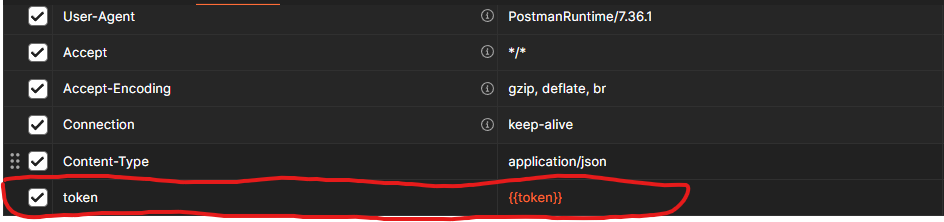
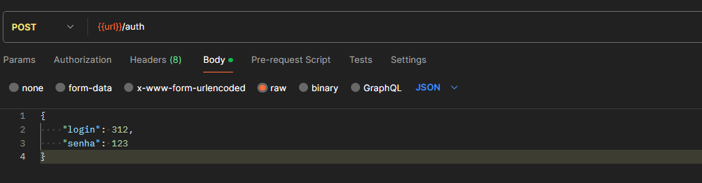
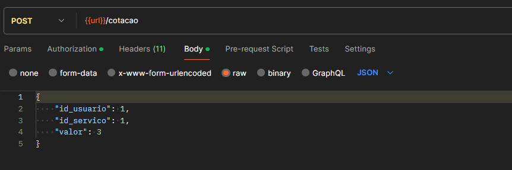
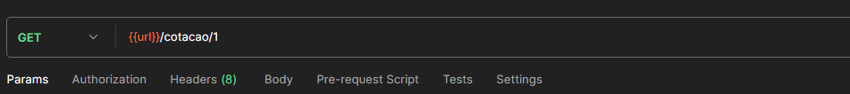
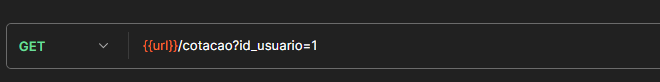
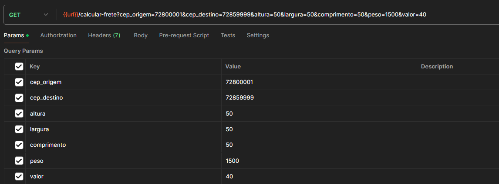

### Instalação

> Na raiz do projeto, execute o comando para instalar as dependencias do composer.json -> _**composer install**_

### Headers
> Toda requisição feita a API é necessário enviar no header o _**token**_ obitido no momento do login. Exemplo:

### Endpoint de login
> POST -> **caminho_do_projeto/auth** - Para realizar a autenticação do usuário. Exemplo:

### Endpoint de cadastrar cotação
> POST -> **caminho_do_projeto/cotacao** - Para realizar o cadastro de uma nova cotação. Exemplo:

### Endpoint de mostrar uma cotação
> GET -> **caminho_do_projeto/cotacao/id_da_cotacao** - Para mostrar as informações de uma cotação em específico. Exemplo:

### Endpoint de listar todas as cotações de um usuário
> GET -> **caminho_do_projeto/cotacao?id_usuario=id_do_usuario** - Para mostrar todas as cotações cadastradas por um usuário. Exemplo:

### Calcular frete
> GET -> **caminho_do_projeto/calcular-frete** - Para cacular o frete com as nas informações oferecidas como parâmetro. Exemplo:
 
